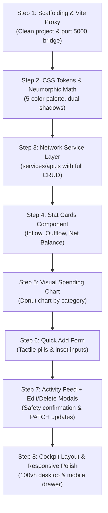

# 🧭 Master Pedagogical Guide: Building the Finance Tracker Frontend

> **Target Audience:** Mentor (Antigravity) & Architect/Developer (User)  
> **Mission:** Build a studio-grade, bespoke Neumorphic React frontend from scratch, step-by-step, with complete architectural understanding and muscle memory.  
> **Key Enhancements Over Generic AI UI:** Edit transaction support (`PATCH`), tactile delete confirmation dialog, high-contrast Earth palette, zero-scroll desktop cockpit.

---

## 📌 Part 1: Backend Pre-Requisites & Changes (`finance_services.py`)

Before building the frontend, we audited and patched the Flask/PostgreSQL backend to ensure data contracts are robust:

### 1. The Category Foreign Key Join Bug
* **The Problem:** In the legacy `get_transactions()` function, the SQL query only selected `category_id`:
  ```sql
  SELECT id, type, amount, description, category_id, logged_at, created_at FROM transactions
  ```
  When the frontend received this data, `tx.category` was `undefined`. This caused the spending chart to render an empty slice labeled `"undefined"`.
* **The Fix Applied:**
  Joined the `categories` table and aliased `c.name AS category`, and sorted newest records first:
  ```sql
  SELECT t.id, t.type, t.amount, t.description, t.category_id, c.name AS category, t.logged_at, t.created_at
  FROM transactions t
  LEFT JOIN categories c ON t.category_id = c.id
  ORDER BY t.logged_at DESC, t.id DESC
  ```

### 2. Backend Endpoints Available for Full CRUD
| Method | Endpoint | Purpose | Payload / Args |
| :--- | :--- | :--- | :--- |
| `GET` | `/finance_tracker/summary` | Fetch income, expenses, and net savings | `?category=...` (optional) |
| `GET` | `/finance_tracker` | Fetch all transactions with joined category names | `?category=...` (optional) |
| `POST` | `/finance_tracker` | Create a new transaction | `{ amount, type, category, description, logged_at }` |
| `PATCH` | `/finance_tracker/<id>` | **Edit an existing transaction** | `{ type, amount, description, logged_at }` |
| `DELETE` | `/finance_tracker/<id>` | **Delete a transaction record** | `{ type }` |

---

## 🚫 Part 2: Escaping the "Generic AI UI" Trap

Why did the first prototype look like a generic AI template?
1. **Monochromatic Overload:** Everything was bathed in the exact same olive green (`#283618`), making the page feel heavy, flat, and muddy.
2. **Missing Real-World UX Polish:**
   - **No Delete Confirmation:** In real finance applications, clicking "Delete" must prompt a confirmation dialog to prevent irreversible data loss.
   - **No Edit Capability:** Real users make typos. The app lacked the ability to modify an amount, category, or note.
3. **Improper Contrast & Spacing:** Text wasn't paired with its semantic role, and cards lacked physical elevation.

### The Bespoke Studio-Grade Solution:
* **The 3-Layer Elevation System:**
  - Layer 0 (Canvas): `#171f0f` (Deep forest soil base).
  - Layer 1 (Cards): `#283618` (Sculpted moss panels extruded via dual shadows).
  - Layer 2 (Active States & Modals): High-contrast Ochre Sand (`#dda15e`) and Terracotta (`#bc6c25`).
* **Micro-Interactions:** Tactile button depression on `:active`, smooth modal transitions for editing, and subtle hover glows.

---

## 🗺️ Part 3: Step-by-Step Interactive Learning Roadmap

We will build the frontend iteratively across **8 manageable milestones**. For each step, you will inspect the code, understand the concepts, and type it into your editor:



### Detailed Milestone Breakdown:

#### Step 1: Clean Scaffolding & Vite Proxy Setup
* **Goal:** Initialize Vite React, clean default template files, and set up `vite.config.js` proxy.
* **Concept Learned:** Why Vite is used, how development servers work, and how proxying prevents CORS issues.

#### Step 2: Neumorphic Design System (`index.css`)
* **Goal:** Set up `:root` CSS variables for our Earth palette, build utility classes (`.neu-panel`, `.neu-inset`, `.neu-btn`), and establish 100vh zero-scroll.
* **Concept Learned:** Dual-shadow light physics (sunlight vs shadow math), CSS Custom Properties, Box Model.

#### Step 3: Network API Layer (`services/api.js`)
* **Goal:** Write clean `async/await` functions wrapping the `fetch()` API for all 5 backend endpoints (including `PATCH` and `DELETE`).
* **Concept Learned:** Promises, HTTP status handling, request headers, payload serialization.

#### Step 4: Metric Stat Cards (`components/StatCards.jsx`)
* **Goal:** Render Total Income, Total Expenses, and Net Savings with semantic badges.
* **Concept Learned:** React Functional Components, Props destructuring, defensive defaults (`|| 0`), number formatting.

#### Step 5: Category Donut Chart (`components/SpendingChart.jsx`)
* **Goal:** Aggregate expenses by category in JavaScript and display a responsive Donut chart using Chart.js.
* **Concept Learned:** Array manipulation (`filter`, `reduce`), external chart integration, canvas lifecycle.

#### Step 6: Tactile Quick-Add Form (`components/TransactionForm.jsx`)
* **Goal:** Build an intuitive form with debossed inputs and a tactile toggle switch (`[+ Income | - Expense]`).
* **Concept Learned:** Controlled components (`useState`), form submission handling (`e.preventDefault`), UX feedback.

#### Step 7: Activity Feed with Edit & Delete Confirmation Modals
* **Goal:** 
  1. Render a sleek, scrollable transaction table.
  2. Clicking "Delete" opens a confirmation modal: *"Are you sure? This cannot be undone."*
  3. Clicking "Edit" opens an edit modal allowing the user to modify amount/description via `PATCH /finance_tracker/<id>`.
* **Concept Learned:** Modal state management, conditional rendering, optimistic UI vs server synchronization.

#### Step 8: App Coordinator & Responsive Layout (`App.jsx`)
* **Goal:** Assemble the cockpit grid layout on desktop, implement responsive mobile view tabs, and centralize state.
* **Concept Learned:** State lifting, `useEffect` data fetching, container-presenter architecture.

---

## 🎯 Verification Plan

### Automated Verification:
- Run `docker compose exec web pytest` to ensure all 7 backend tests remain passing.
- Run `npm run build` in `frontend/` at each milestone to catch TypeScript/JSX compilation errors early.

### Interactive Visual Verification:
- Launch `npm run dev` and test live in the browser.
- Verify that editing a transaction updates PostgreSQL immediately.
- Verify that deleting a transaction prompts confirmation before removal.
- Test responsive viewports (Desktop 1920x1080 vs Mobile 375x667) using browser DevTools.
